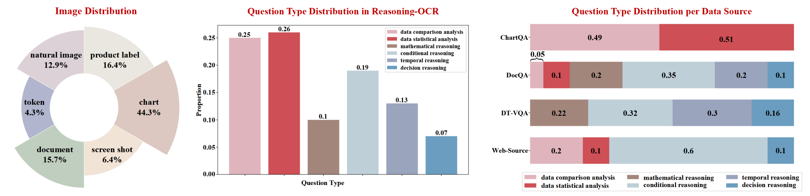
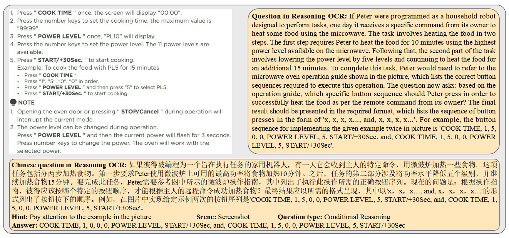
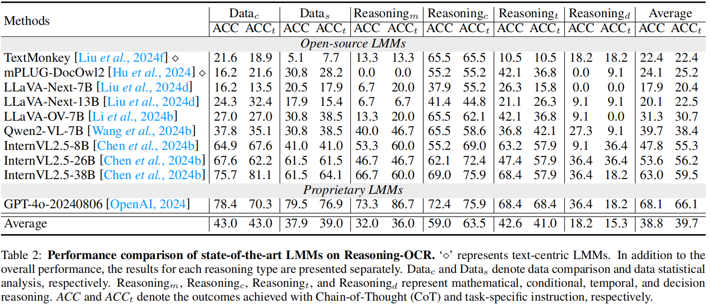

# Reasoning-OCR

**Reasoning-OCR: Can Large Multimodal Models Solve Complex Logical Reasoning Problems from OCR Cues?**

<p align="center">
    │ &nbsp&nbsp📑 <a href="https://arxiv.org/abs/2505.12766">ArXiv</a>&nbsp&nbsp │
    🤗 <a href="https://huggingface.co/datasets/loptr/ReasoningOCR">Hugging Face</a> <a>


## 🔥 Overview

Large Multimodal Models (LMMs) have become increasingly versatile, accompanied by impressive Optical Character Recognition (OCR) related capabilities. 
Existing OCR-related benchmarks emphasize evaluating LMMs' abilities of relatively simple visual question answering, visual-text parsing, etc. However, the extent to which LMMs can deal with complex logical reasoning problems based on OCR cues is relatively unexplored.  
To this end, we introduce the **Reasoning-OCR** benchmark, which challenges LMMs to solve complex reasoning problems based on the cues that can be extracted from rich visual-text. 
**Reasoning-OCR** covers six visual scenarios and encompasses 150 meticulously designed questions categorized into six reasoning challenges. Additionally, Reasoning-OCR minimizes the impact of field-specialized knowledge. 
Our evaluation offers some insights for proprietary and open-source LMMs in different reasoning challenges, underscoring the urgent to improve the reasoning performance.
We hope Reasoning-OCR can inspire and facilitate future research on enhancing complex reasoning ability based on OCR cues.


## 📌 Key Findings

- **LMMs desire enhancement on complex reasoning using OCR cues.**

- **Text-centric LMMs lag far behind advanced generic LMMs on reasoning ability.**

- **LMMs fall short in decision reasoning.**

- **CoT generally helps LMMs achieve better reasoning performance.**

- **Providing the answer hint can improve the accuracy.**

- **Designing task-specific instruction may be helpful.**

For main results and detailed analysis, please refer to the paper.


## 🗞️ News

- **`2025-07-24`**: 📑 We released the dataset [Hugging Face](https://huggingface.co/datasets/loptr/ReasoningOCR) and the code for evaluation.
- **`2025-05-19`**: 📑 We released our initial [ArXiv paper](https://arxiv.org/abs/2505.12766) of **Reasoning-OCR**.


## 🔭 Datasets

- **`[Distributions]`**

<div align="center">

</div>


- **`[Example]`**

<div align="center">

</div>


## 🔨 Evaluation

```python
### First, download the code and dataset
git clone https://github.com/Hxyz-123/ReasoningOCR
cd ReasoningOCR
wget https://huggingface.co/datasets/loptr/ReasoningOCR/resolve/main/img.zip
unzip img.zip
wget https://huggingface.co/datasets/loptr/ReasoningOCR/resolve/main/qa.json
    
### Second, eval the vlms. You can use example/qwen2_vl.py as a guide to run inference on your target VLM.
python example/qwen2_vl.py --model_path path_to_model --device 0 --img_path ./img --json_path ./qa.json --out_path ./org_results/qwen2vl-7b

### Third, use regular expressions or GPT-4o to extract the answer.
python eval/ans_extr.py --org_path ./org_results/qwen2vl-7b --json_path ./qa.json --out_path ./ext_results/qwen2vl-7b

### Finally, evaluate the answer accuracy.
python eval/eval.py --ans_path ./ext_results/qwen2vl-7b --json_path ./qa.json
```


## ⭐️ Main Results 

<div align="center">

</div>


## 📜 License

 **Reasoning-OCR** is licensed under [CC BY-NC-SA 4.0](https://creativecommons.org/licenses/by-nc-sa/4.0/).


## 💗 Acknowledgement

The raw image in  **Reasoning-OCR**  are collected from [ChartQA](https://github.com/vis-nlp/ChartQA), [DocQA](https://github.com/anisha2102/docvqa), [DT-VQA](https://github.com/ShuoZhang2003/DT-VQA), and websites.


## 📑 Citation

If you find this project useful, welcome to cite us.

```bib
@article{he2025reasoningocr,
      title={Reasoning-OCR: Can Large Multimodal Models Solve Complex Logical Reasoning Problems from OCR Cues?}, 
      author={Haibin He and Maoyuan Ye and Jing Zhang and Xiantao Cai and Juhua Liu and Bo Du and Dacheng Tao},
      journal={arXiv preprint arXiv:2505.12766},
      year={2025},
}
```

